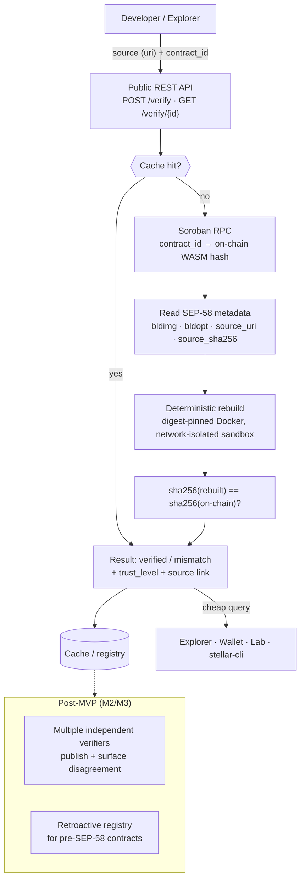

# Soroban Contract Verification Service

An open-source, multi-verifier source verification service that proves a Soroban smart contract's on-chain WASM bytes were built from the public source code shown on explorers.

> Status: hackathon MVP in progress. See [PLAN.md](PLAN.md) for the day-by-day build plan and [idea1-project-brief.md](idea1-project-brief.md) for the full project brief.

## Problem

On Stellar/Soroban, a deployed contract is opaque bytes — there's no programmatic way to confirm that the source code shown on an explorer actually compiles to those bytes. SEP-55 (CI attestation) proves provenance, not source-to-bytecode correspondence.

## Solution

Rebuild the contract from source in a deterministic, isolated environment (digest-pinned Docker image), byte-compare the resulting WASM's sha256 against the on-chain hash, and serve the result through a free public API.



## MVP scope

- Single verification flow: source (git repo/commit) + target WASM hash → deterministic Docker rebuild → sha256 compare
- REST API: `POST /verify`, `GET /verify/{contract_id|wasm_hash}`
- Testnet only, simple result cache
- Multi-verifier decentralization and retroactive verification are architected for but out of scope for the MVP — see [PLAN.md](PLAN.md).

## Stack

Rust, Axum, Docker, Soroban RPC, `stellar-cli`.

## Repo layout

```
crates/
  verifier-core/   # SEP-58 metadata model, sha256 compare, reproduction pipeline (Day1)
  api/             # public REST API — Axum server, cache, on-chain lookup (Day2)
docs/
  sep-58-notes.md  # extracted SEP-58 field reference our verifier consumes
PLAN.md            # day-by-day MVP build plan
```

## Development

```bash
cargo build            # build the workspace
cargo test -p verifier-core
```

The deterministic build engine (Day1) runs untrusted source inside a network-isolated,
digest-pinned Docker container. On the Linux deploy target this is native Docker; for local
dev on Windows we run Docker inside WSL2 (Ubuntu) rather than Docker Desktop.

## License

MIT

