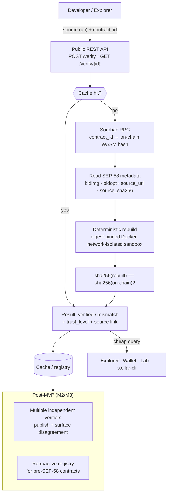

# Sorofy — Soroban Contract Verification

An open-source, multi-verifier source verification service that proves a Soroban smart contract's on-chain WASM bytes were built from the public source code shown on explorers.

> Status: hackathon MVP in progress. See [PLAN.md](PLAN.md) for the day-by-day build plan and [idea1-project-brief.md](idea1-project-brief.md) for the full project brief.

## Problem

On Stellar/Soroban, a deployed contract is opaque bytes — there's no programmatic way to confirm that the source code shown on an explorer actually compiles to those bytes. SEP-55 (CI attestation) proves provenance, not source-to-bytecode correspondence.

## Solution

Rebuild the contract from source in a deterministic, isolated environment (digest-pinned Docker image), byte-compare the resulting WASM's sha256 against the on-chain hash, and serve the result through a free public API.



## MVP scope

- Single verification flow: source (git repo/commit) + target WASM hash → deterministic Docker rebuild → sha256 compare
- REST API: `POST /verify`, `GET /verify/{contract_id|wasm_hash}`
- Testnet only, simple result cache
- Multi-verifier decentralization and retroactive verification are architected for but out of scope for the MVP — see [PLAN.md](PLAN.md).

## Stack

Rust, Axum, Docker, Soroban RPC, `stellar-cli`.

## Repo layout

```
crates/
  verifier-core/   # SEP-58 reproduction pipeline + `verify-core` CLI (Day1)
  api/             # public REST API — Axum server, cache, on-chain lookup (Day2)
docker/
  build-image/     # digest-pinned build image (SEP-58 `bldimg`)
docs/
  sep-58-notes.md              # SEP-58 field reference our verifier consumes
  day0-reproduction-findings.md # manual reproduction + determinism experiments
  day1-build-engine.md          # build engine results, sandbox design, friction log
PLAN.md            # day-by-day MVP build plan
```

## The build engine

`verify-core` rebuilds a contract from source and compares the result to an on-chain
WASM hash:

```bash
cargo run -p verifier-core --bin verify-core -- \
  --repo https://github.com/erdemasik001/stellar-verify-fixture-hello-world \
  --rev c08333e9924bfb45ee221f3edeb8ded4d4840397 \
  --bldimg sorofy/build-image:rust1.91.1-cli23.2.1 --allow-unpinned-image \
  --wasm-hash b68602842d3a1d169d54fe3e57c0511a774df4710553d6d4d22e653d62bf5f5b
```

That command reproduces the Day0 contract from its published source fixture
([`stellar-verify-fixture-hello-world`](https://github.com/erdemasik001/stellar-verify-fixture-hello-world))
and prints `VERIFIED` — copy-paste runnable once the build image exists (below).
For a digest-pinned `bldimg` on a registry, drop `--allow-unpinned-image`.

Exit codes: `0` verified, `1` mismatch, `2` error. Add `--json` for the full report.

A job runs as two containers sharing a `CARGO_HOME` volume: `cargo fetch --locked`
**with** network, then `stellar contract build` with **`--network=none`**. Compiling runs
untrusted code (`build.rs`, proc macros), so that phase gets no network; fetching does not
execute anything, so it can have one. Source enters and artifacts leave over tar streams
rather than bind mounts, and builds run non-root. See
[docs/day1-build-engine.md](docs/day1-build-engine.md).

Verified end to end: the containerized build reproduces the Day0 contract byte-identically
(`b68602…`), and a one-word source change flips it to `mismatch`. The engine also
reproduces a real token contract we built in the pinned container and deployed to testnet
([`CAZAVVTM…`](https://stellar.expert/explorer/testnet/contract/CAZAVVTM3GXFNCLR66FYHJJ43MEEUV3C6PQYRQT5JVGAO2RS6S4OHRT6)) —
see [docs/day2-api.md](docs/day2-api.md).

## The API

`sorofy-api` fronts the engine with a job queue and a result cache:

```bash
SOROFY_ALLOW_UNPINNED_IMAGE=1 cargo run -p api --bin sorofy-api

# Verify a deployed contract: the expected hash is resolved on-chain via
# Soroban RPC, never taken from the caller.
curl -X POST localhost:8080/verify -H 'Content-Type: application/json' -d '{
  "contract_id": "CAZAVVTM3GXFNCLR66FYHJJ43MEEUV3C6PQYRQT5JVGAO2RS6S4OHRT6",
  "repo": "https://github.com/erdemasik001/sorofy-fixture-token",
  "rev": "cd68767f3b36456228b01244ecd4e6f935b5e986",
  "bldimg": "sorofy/build-image:rust1.91.1-cli23.2.1"
}'
# → {"id":1,"status":"pending","wasm_hash":"47d2801e…"}

curl localhost:8080/verify/CAZAVVTM3GXFNCLR66FYHJJ43MEEUV3C6PQYRQT5JVGAO2RS6S4OHRT6
# → {"status":"verified", "report":{…, "trust_level":"arbitrary"}, …}
```

`GET /verify/{id|contract_id|wasm_hash}` serves the cached result: `pending` /
`verified` / `mismatch` / `error` / `404 not_found`. SQLite-backed; results
survive restarts.

## Development

```bash
cargo build                    # build the workspace
cargo test --workspace         # offline unit tests

# Build the image the verifier builds contracts in
docker build --platform linux/amd64 \
  -t sorofy/build-image:rust1.91.1-cli23.2.1 docker/build-image

# End-to-end reproduction tests: rebuild the published fixture in a container
# and check the four verified/mismatch cases. Needs Docker + the image above,
# so they are #[ignore]d out of the default run.
cargo test -p verifier-core -- --ignored
```

On the Linux deploy target this is native Docker; for local dev on Windows we run Docker
Engine inside WSL2 (Ubuntu) rather than Docker Desktop. `verify-core` detects that and
shells into WSL automatically — override with `VERIFY_DOCKER="wsl -d Ubuntu -- docker"`.

## License

MIT

