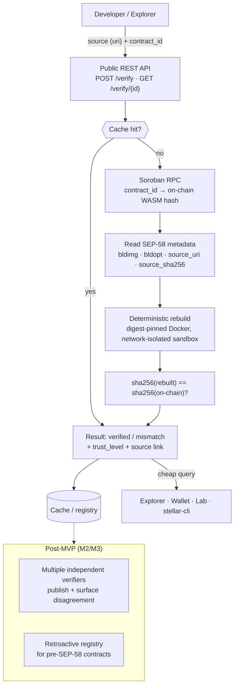

# Sorofy — Soroban Contract Verification

An open-source, multi-verifier source verification service that proves a Soroban smart contract's on-chain WASM bytes were built from the public source code shown on explorers.

> ## 🏆 Stellar Pro Hackathon 2026 · Scale track — submission: **[HACKATHON.md](HACKATHON.md)**
>
> A **dated delta** on top of the service described below: a Soroban verifier **registry**
> (staking, conservative consensus, slashing) and a **verification gate** that refuses a Blend v2
> deposit into code no staked verifier has attested. Deployed to testnet and readable on-chain
> today — the gate needs no wallet, no account and no token to return a verdict.
>
> **Live demo: [sorofy.site/gate/](https://sorofy.site/gate/)** — check any Soroban contract; no wallet, no
> account, no token, no payment.
>
> Architecture drawn from running code: [docs/hackathon-architecture.md](docs/hackathon-architecture.md) ·
> post-hackathon roadmap: [docs/hackathon-roadmap.md](docs/hackathon-roadmap.md) ·
> the honest limits are listed in the delta itself.
>
> **Everything below this block predates the hackathon (2026-09-19) and does not describe it.**

> ## 🟢 Live on testnet: **[https://sorofy.site](https://sorofy.site)**
>
> Open it in a browser for the explorer, or `curl` it for JSON — the same URL serves both.
> A verified contract, expected and rebuilt hash side by side:
> [`CAZAVVTM…`](https://sorofy.site/#/v/CAZAVVTM3GXFNCLR66FYHJJ43MEEUV3C6PQYRQT5JVGAO2RS6S4OHRT6)
> in the explorer, or [as JSON](https://sorofy.site/verify/CAZAVVTM3GXFNCLR66FYHJJ43MEEUV3C6PQYRQT5JVGAO2RS6S4OHRT6).
>
> **Status: the MVP was awarded by the SCF; it is now deployed as a testnet-grade
> service.** The engine reproduces a real testnet contract byte-for-byte against its
> on-chain hash, the retroactive path is proven, and the build image is published to GHCR
> with digest enforcement on. Since the award the service has gained bearer-token auth,
> rate limiting + a bounded job queue, `/health` + `/metrics` + structured request logs,
> schema migrations + cache snapshots, a sandbox hardened against the findings of a
> security review, a browsable explorer over the cache, and a CI lane that runs the real
> Docker/RPC tests. The 2026-08-16 deploy closed the last two open controls — filtered
> fetch egress (G4-b) and TLS (G7) — and took Phase 0's quality gate green.
>
> Roadmap and live status: [docs/testnet-roadmap.md](docs/testnet-roadmap.md) · threat
> model and gap register: [docs/security.md](docs/security.md) · deploy playbook:
> [docs/deploy-playbook.md](docs/deploy-playbook.md) · MVP build log: [PLAN.md](PLAN.md) ·
> full brief: [idea1-project-brief.md](idea1-project-brief.md).

## Problem

On Stellar/Soroban, a deployed contract is opaque bytes — there's no programmatic way to confirm that the source code shown on an explorer actually compiles to those bytes. SEP-55 (CI attestation) proves provenance, not source-to-bytecode correspondence.

## Solution

Rebuild the contract from source in a deterministic, isolated environment (digest-pinned Docker image), byte-compare the resulting WASM's sha256 against the on-chain hash, and serve the result through a free public API.


```mermaid
flowchart TD
    dev["Developer / Explorer"] -->|"source (uri) + contract_id"| api["Public REST API<br/>POST /verify · GET /verify/{id}"]
    api --> cache{{"Cache hit?"}}
    cache -->|yes| result
    cache -->|no| rpc["Soroban RPC<br/>contract_id → on-chain WASM hash"]
    rpc --> meta["Read SEP-58 metadata<br/>bldimg · bldopt · source_uri · source_sha256"]
    meta --> build["Deterministic rebuild<br/>digest-pinned Docker, network-isolated sandbox"]
    build --> cmp["sha256(rebuilt) == sha256(on-chain)?"]
    cmp --> result["Result: verified / mismatch<br/>+ trust_level + source link"]
    result --> store[("Cache / registry")]
    result -->|cheap query| consumers["Explorer · Wallet · Lab · stellar-cli"]

    subgraph next["Post-MVP (M2/M3)"]
        multi["Multiple independent verifiers<br/>publish + surface disagreement"]
        retro["Retroactive registry<br/>for pre-SEP-58 contracts"]
    end
    store -.-> next
```

## What the service does today

- Verification flow: source (git repo/commit **or** SEP-58 `source_uri` archive) → deterministic, network-isolated Docker rebuild → sha256 compare against the on-chain hash
- REST API: `POST /verify` (bearer-token auth, rate-limited, bounded queue), `GET /verify/{id|contract_id|wasm_hash}`, `GET /verifications` (newest-first page), plus `GET /health` and `GET /metrics`
- A browsable **explorer** over the cache at `GET /`, which content-negotiates on `Accept`: a browser gets the UI, `curl` gets the endpoint listing as JSON. Page, stylesheet, script and fonts are compiled into the binary with `include_str!` — no build step and nothing fetched at runtime, so it works on a host with no egress
- SQLite result cache with versioned schema migrations and `VACUUM INTO` snapshots — results survive restarts and upgrades
- On-chain WASM hash resolved from Soroban RPC — the caller cannot assert the target
- Sandbox: `--network=none` build, non-root, no bind mounts, memory/CPU/PID/swap caps, `--cap-drop=ALL`, `no-new-privileges`, SSRF-guarded source fetch ([docs/security.md](docs/security.md))
- Testnet only
- Multi-verifier decentralization and the retroactive *registry* are architected for but not yet built — see the [roadmap](#roadmap--what-happens-next).

### What's proven (every row is a real run, not a mockup)

| Claim | Evidence |
|---|---|
| Deterministic containerized rebuild | Day0 contract reproduced byte-identically (`b68602…`); a one-word source change flips it to `mismatch` — [day1](docs/day1-build-engine.md) |
| Network-isolated sandbox | Two phases sharing one `CARGO_HOME`: `cargo fetch` online, `stellar contract build` with `--network=none`; non-root, no bind mounts — [day1](docs/day1-build-engine.md) |
| Real-size, on-chain | A token contract built in the pinned image, deployed to testnet ([`CAZAVVTM…`](https://stellar.expert/explorer/testnet/contract/CAZAVVTM3GXFNCLR66FYHJJ43MEEUV3C6PQYRQT5JVGAO2RS6S4OHRT6)), reproduced byte-for-byte against its RPC-resolved hash (`47d2801e…`) — [day2](docs/day2-api.md) |
| Retroactive path | The same contract carries **no** SEP-58 metadata on-chain, yet is verified from out-of-band source — [day3](docs/day3-deploy-demo.md) |
| Real `bldimg` digest | Image published to GHCR (single-arch, `sha256:cff44167…`); digest enforcement on by default — bare tags rejected before any container — [day3](docs/day3-deploy-demo.md) |
| Hardening doesn't break the build | The same fixture still reproduces byte-for-byte with the swap/capability/privilege caps applied and the fetch phase pinned to a dedicated network — [security.md](docs/security.md) |
| Tested in CI, not just locally | The `#[ignore]`d suite — 6 reproduction cases (real containers) + live RPC lookups — runs on merges to `master` via [`integration.yml`](.github/workflows/integration.yml) |
| Live, not just deployable | [`https://sorofy.site`](https://sorofy.site) serves the results of real rebuilds run on that host: 24 jobs — 19 `verified`, 4 deliberate `mismatch`, 1 deliberate `error` (a bare-tag `bldimg`, refused before any container) — average build 85.0 s over 23 builds. Recomputable at any time from [`GET /verifications`](https://sorofy.site/verifications) |
| Two real testnet contracts, hashes from the network | [`CAZAVVTM…`](https://stellar.expert/explorer/testnet/contract/CAZAVVTM3GXFNCLR66FYHJJ43MEEUV3C6PQYRQT5JVGAO2RS6S4OHRT6) (token, 8 584 B) and [`CAEA4BXA…`](https://stellar.expert/explorer/testnet/contract/CAEA4BXANQ2JQR4AF5XG53A25LU5N2QERRFC5P7ZY4W6YDQ4DGLEZRYH) (hello-world, 660 B) both `verified` through the live API against hashes **resolved via RPC**, not supplied by the caller — [roadmap](docs/testnet-roadmap.md) |
| Tamper is caught by the hash, not by luck | One word changed in the fixture (`"Hello"` → `"Howdy"`) still compiles to **exactly 660 bytes**, and `verify-core` returns `MISMATCH` with exit code 1: `2f8a8fff…` against the expected `b68602…` |

### Differentiation (why us)

The RFP's three hardest requirements are the parts competitors do least — and where this project aims:

1. **Decentralization / multi-verifier** *(RFP hard requirement)* — independent verifiers publishing results and surfacing disagreement; a single hardcoded verifier "does not meet the bar."
2. **Retroactive verification** *(RFP priority requirement)* — an off-chain registry for pre-SEP-58 contracts that cannot embed metadata; highest-value, most-skipped, and **already proven at the engine level** (above).
3. **Trust levels, not a binary** — image trust tiers (`arbitrary` / `publicly-auditable` / `sdf-maintained`) plus a vetted image allowlist, instead of a flat verified/unverified.

## Stack

Rust, Axum, Docker, Soroban RPC, `stellar-cli`.

## Repo layout

```
crates/
  verifier-core/   # SEP-58 reproduction pipeline + `verify-core` CLI (Day1)
  api/             # public REST API — Axum server, cache, on-chain lookup (Day2)
    static/        # the explorer UI, compiled into the binary (no build step, no CDN)
docker/
  build-image/     # digest-pinned build image (SEP-58 `bldimg`) + publish.sh
  api/             # runtime image for the sorofy-api service (Day3)
docs/
  api-reference.md              # every endpoint, schema, status code, limit + curl examples
  delivery-note.md              # one-page, non-technical summary of what shipped
  testnet-roadmap.md            # post-award roadmap: Phase 0-3, live status
  security.md                   # threat model + gap register (G1-G7), audit status
  deploy-playbook.md            # step-by-step testnet deploy: egress filter, TLS, smoke tests
  adr/                          # architecture decision records
  sep-58-notes.md               # SEP-58 field reference our verifier consumes
  day0-reproduction-findings.md # manual reproduction + determinism experiments
  day1-build-engine.md          # build engine results, sandbox design, friction log
  day2-api.md                   # REST API, on-chain lookup, cache, real-size build
  day3-deploy-demo.md           # retroactive path, publish, deploy-readiness, demo
  pitch-deck.html               # 8-slide jury pitch (self-contained HTML)
.github/workflows/
  ci.yml             # offline gate: fmt · clippy · build · test (every push/PR)
  integration.yml    # the #[ignore]d Docker/RPC tests (master + on demand)
  audit.yml          # cargo audit over the locked tree (dep changes + weekly)
scripts/
  demo.ps1           # demo runner, PowerShell (retroactive verify + tamper→mismatch)
  demo.sh            # the same demo in bash/curl/python3 — no PowerShell needed
PLAN.md            # day-by-day MVP build plan (complete; superseded by the roadmap)
```

## The build engine

`verify-core` rebuilds a contract from source and compares the result to an on-chain
WASM hash:

```bash
cargo run -p verifier-core --bin verify-core -- \
  --repo https://github.com/erdemasik001/stellar-verify-fixture-hello-world \
  --rev c08333e9924bfb45ee221f3edeb8ded4d4840397 \
  --bldimg sorofy/build-image:rust1.91.1-cli23.2.1 --allow-unpinned-image \
  --wasm-hash b68602842d3a1d169d54fe3e57c0511a774df4710553d6d4d22e653d62bf5f5b
```

That command reproduces the Day0 contract from its published source fixture
([`stellar-verify-fixture-hello-world`](https://github.com/erdemasik001/stellar-verify-fixture-hello-world))
and prints `VERIFIED` — copy-paste runnable once the build image exists (below).
For a digest-pinned `bldimg` on a registry, drop `--allow-unpinned-image`.

Exit codes: `0` verified, `1` mismatch, `2` error. Add `--json` for the full report.

A job runs as two containers sharing a `CARGO_HOME` volume: `cargo fetch --locked`
**with** network, then `stellar contract build` with **`--network=none`**. Compiling runs
untrusted code (`build.rs`, proc macros), so that phase gets no network; fetching does not
execute anything, so it can have one. Source enters and artifacts leave over tar streams
rather than bind mounts, and builds run non-root. See
[docs/day1-build-engine.md](docs/day1-build-engine.md).

Verified end to end: the containerized build reproduces the Day0 contract byte-identically
(`b68602…`), and a one-word source change flips it to `mismatch`. The engine also
reproduces a real token contract we built in the pinned container and deployed to testnet
([`CAZAVVTM…`](https://stellar.expert/explorer/testnet/contract/CAZAVVTM3GXFNCLR66FYHJJ43MEEUV3C6PQYRQT5JVGAO2RS6S4OHRT6)) —
see [docs/day2-api.md](docs/day2-api.md).

## The API

`sorofy-api` fronts the engine with a job queue and a result cache:

```bash
cargo run -p api --bin sorofy-api    # digest enforcement on by default

# Verify a deployed contract: the expected hash is resolved on-chain via
# Soroban RPC, never taken from the caller. `bldimg` is the published,
# digest-pinned build image (a bare tag is rejected — see below).
curl -X POST localhost:8080/verify -H 'Content-Type: application/json' -d '{
  "contract_id": "CAZAVVTM3GXFNCLR66FYHJJ43MEEUV3C6PQYRQT5JVGAO2RS6S4OHRT6",
  "repo": "https://github.com/erdemasik001/sorofy-fixture-token",
  "rev": "cd68767f3b36456228b01244ecd4e6f935b5e986",
  "bldimg": "ghcr.io/erdemasik001/sorofy-build-image@sha256:cff44167d2ee90f901c768ccdb75eb5c382c95295f44bcd7ee4b543f0adf9588"
}'
# → {"id":1,"status":"pending","wasm_hash":"47d2801e…"}

curl localhost:8080/verify/CAZAVVTM3GXFNCLR66FYHJJ43MEEUV3C6PQYRQT5JVGAO2RS6S4OHRT6
# → {"status":"verified", "report":{…, "trust_level":"arbitrary"}, …}
```

`GET /verify/{id|contract_id|wasm_hash}` serves the cached result: `pending` /
`verified` / `mismatch` / `error` / `404 not_found`. SQLite-backed; results
survive restarts.

Full endpoint, schema, status-code and limit reference:
**[docs/api-reference.md](docs/api-reference.md)**.

### Operating it

`POST /verify` spends build capacity and drives the Docker socket, so it is gated;
`GET` stays public — a cheap cached lookup is the whole point of the service.

```bash
SOROFY_API_TOKEN=… cargo run -p api --bin sorofy-api   # POST requires the token
curl -X POST localhost:8080/verify -H "Authorization: Bearer $SOROFY_API_TOKEN" …

curl localhost:8080/health    # {"status":"ok"} — liveness + cache ping (503 if degraded)
curl localhost:8080/metrics   # job counters: submitted / in_flight / verified / mismatch / error / avg_build_seconds
```

Over the rate limit or with too many jobs already in flight, `POST` returns `429`
(with `Retry-After` when it is the rate limit). Every request is logged with method,
path, status, and latency — never headers or bodies, so tokens are not captured.

| Env | Default | Purpose |
|---|---|---|
| `SOROFY_BIND` | `127.0.0.1:8080` | listen address |
| `SOROFY_DB` | `sorofy.db` | SQLite cache path |
| `SOROFY_RPC` | public testnet | Soroban RPC endpoint |
| `SOROFY_API_TOKEN` | *(unset ⇒ open)* | bearer token for `POST /verify`; **set before exposing the service** |
| `SOROFY_ALLOW_UNPINNED_IMAGE` | off | accept a non-digest `bldimg` (local dev) |
| `SOROFY_BACKUP_DIR` | *(unset ⇒ off)* | write periodic cache snapshots here |
| `SOROFY_BACKUP_INTERVAL_HOURS` | `24` | snapshot interval |
| `VERIFY_DOCKER` | autodetect | how to invoke docker (e.g. `wsl -d Ubuntu -- docker`) |
| `VERIFY_FETCH_NETWORK` | *(unset ⇒ bridge)* | run the fetch phase on a pre-created, egress-filtered network ([ADR-0001](docs/adr/0001-fetch-egress-control.md)) |

### Retroactive verification (no on-chain source metadata)

The same contract carries **no SEP-58 source fields** on-chain, yet it can still
be verified by supplying its source out-of-band as an archive. The target hash is
resolved from the network — the caller passes no `wasm_hash`:

```bash
curl -X POST localhost:8080/verify -H 'Content-Type: application/json' -d '{
  "contract_id": "CAZAVVTM3GXFNCLR66FYHJJ43MEEUV3C6PQYRQT5JVGAO2RS6S4OHRT6",
  "source_uri": "https://github.com/erdemasik001/sorofy-fixture-token/archive/cd68767f3b36456228b01244ecd4e6f935b5e986.tar.gz",
  "source_sha256": "1cde007365bb93f6dae9b6f2e42b0bf29364c44fa031399116a6cfafa4ede416",
  "bldimg": "ghcr.io/erdemasik001/sorofy-build-image@sha256:cff44167d2ee90f901c768ccdb75eb5c382c95295f44bcd7ee4b543f0adf9588"
}'
# → rebuilt sha256 == on-chain sha256 (47d2801e…) → verified
```

This is the pre-SEP-58 / retroactive path — see [docs/day3-deploy-demo.md](docs/day3-deploy-demo.md).

The build image is published at
[`ghcr.io/erdemasik001/sorofy-build-image`](https://github.com/users/erdemasik001/packages/container/package/sorofy-build-image),
single-arch, so `bldimg` resolves to one manifest digest. A bare tag is refused:
`build image must be digest-pinned (image@sha256:...)`. For local dev against an
unpublished image, run with `SOROFY_ALLOW_UNPINNED_IMAGE=1`.

## Development

```bash
cargo build                    # build the workspace
cargo test --workspace         # offline unit tests

# Build the image the verifier builds contracts in
docker build --platform linux/amd64 \
  -t sorofy/build-image:rust1.91.1-cli23.2.1 docker/build-image

# End-to-end tests: rebuild the published fixture in a container and check the
# verified / mismatch / tampered / dirty-tree / archive cases, plus live RPC
# lookups. They need Docker + the image above + network, so they are #[ignore]d
# out of the default run.
cargo test --workspace -- --ignored
```

Three CI lanes: [`ci.yml`](.github/workflows/ci.yml) runs the offline gate
(fmt · clippy · build · test) on every push and PR;
[`integration.yml`](.github/workflows/integration.yml) runs the `#[ignore]`d
Docker/RPC suite against the published image on merges to `master` and on demand —
so the heavyweight, network-dependent tests are proven in CI without slowing PRs;
and [`audit.yml`](.github/workflows/audit.yml) checks the locked dependency tree
against the RustSec advisory database on dependency changes *and* weekly, because
an advisory can land against code that never changed.

On the Linux deploy target this is native Docker; for local dev on Windows we run Docker
Engine inside WSL2 (Ubuntu) rather than Docker Desktop. `verify-core` detects that and
shells into WSL automatically — override with `VERIFY_DOCKER="wsl -d Ubuntu -- docker"`.

## Roadmap — what happens next

The MVP proved the core claim (source → on-chain bytecode, including the retroactive case) and
was awarded by the SCF. Work since then was **Phase 0: making it deployable to testnet** — the
security, auth, and operability work a socket-mounted service needs before it faces the
internet. **Phase 0's quality gate is green as of 2026-08-16 and the service is live.** Live
status: [docs/testnet-roadmap.md](docs/testnet-roadmap.md). Full pitch:
[docs/pitch-deck.html](docs/pitch-deck.html).

**Done since the award (Phase 0).** Each closes a gap from the threat model in
[docs/security.md](docs/security.md):

- **Deployed** — live at [`https://sorofy.site`](https://sorofy.site) on a single-tenant VPS,
  Docker-out-of-Docker over the host socket, Caddy terminating TLS with a Let's Encrypt
  certificate and the API published on loopback only, so nothing reaches it around the proxy
  (G7). Fetch containers run on a dedicated network whose egress to internal ranges is dropped
  in `DOCKER-USER`, reinstalled on every boot and verified live (G4-b). All 11 playbook smoke
  tests pass; SLO baseline `avg_build_seconds` 86.49.

- **Auth** — bearer token on `POST /verify`, constant-time compared; `GET` stays public (G2).
- **Rate limiting + bounded queue** — per-principal token bucket and a cap on outstanding jobs;
  over either, `POST` returns `429` (G3).
- **Sandbox hardening** — memory/CPU/PID caps plus `--memory-swap`, `--cap-drop=ALL`,
  `--security-opt=no-new-privileges`, and a disk-quota hook (G1, G6).
- **SSRF hardening** — the source fetch resolves and refuses internal addresses, and now
  re-validates **every redirect hop** rather than only the first URL (G4-a).
- **Observability** — `/health`, `/metrics`, structured per-request logs.
- **Persistence** — versioned schema migrations (forward-only, refuses a newer schema) and
  consistent `VACUUM INTO` cache snapshots.
- **Integration CI lane** — the real Docker/RPC reproduction tests now run in CI, not just by hand.

**M2 — Testnet milestone · trust model, retroactive registry, decentralization**
*(next milestone, after the current funded engagement; [Phases 1–3](docs/testnet-roadmap.md))*

- **Trust-level allowlist** (Phase 1): promote `trust_level` beyond `arbitrary` from a vetted
  image list — the `TrustLevel` enum and response schema are already wired end-to-end.
- Off-chain **retroactive registry** (Phase 2): attach `source_uri` + `source_sha256` + a vetted
  `bldimg` to pre-SEP-58 contracts that can't embed metadata — the engine side is already proven above.
- Multiple independent verifier instances publishing the same result, with an architecture that
  **surfaces disagreement** (Phase 3 — the RFP's hard requirement).

**M3 — Mainnet · ship + integrate** *(+4–8 weeks)*

- Mainnet support.
- Third-party audit via the Soroban **Audit Bank**.
- At least one reference integration (ideally **Stellar Lab**).

## License

MIT

