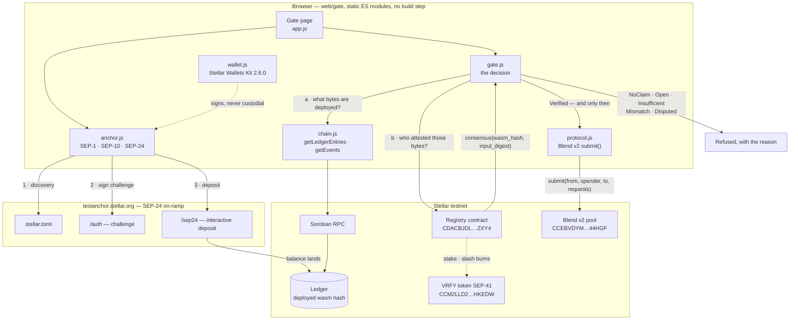
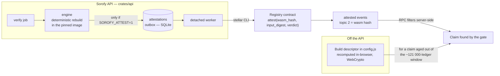
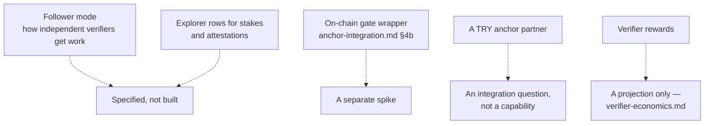

# Architecture — what was actually built

> Drawn from running code on **2026-09-20**, not from the design. Every box below exists in the
> repository and was exercised on testnet; the dashed boxes are the things that do **not** exist,
> drawn in because leaving them out would make the picture flatter than the truth.
>
> The design's own diagram ([hackathon-design.md §12](hackathon-design.md)) is labelled
> *"Planned; drawn from this design, not from running code."* This file is the other one.

## 1. The gate — what a user actually does

A balance comes in through an anchor, and then tries to go into a protocol. The check in the
middle is the whole point, and it costs nothing to run.

**The verdict never comes from Sorofy.** The hash is read from the ledger and the verdict from
the registry. A lying or compromised Sorofy API cannot produce a pass — the worst a bad claim can
do is name something nobody attested, which reads `NoClaim` and blocks.

**Reading is free.** `consensus()` is *simulated* from a keypair generated in the page and thrown
away: never funded, never used to sign. No wallet, no account, no token, no payment.

## 2. How a claim gets on chain

Two independent ways, because the registry files attestations under `(wasm_hash, input_digest)`
and offers no "is anything verified for this hash?" query.

A descriptor only ever asks a question. **The registry always gives the answer.**

## 3. The trust argument, in three layers

| Layer | Mechanism | Where it lives |
|---|---|---|
| **Truth** | A deterministic rebuild anyone can repeat, in a pinned image | `crates/` engine, `bldimg` digest in [`testnet.json`](../contracts/deployments/testnet.json) |
| **Visibility** | Conservative consensus — any dissent yields `Disputed`, never a quiet pass | `contracts/registry`, 35 unit tests |
| **Deterrence** | Majority-based slash, **burned** rather than redistributed, so there is no bounty for manufacturing disputes | `registry::slash`, checked on testnet against the arithmetic |

Exactly one state opens the gate. That is pinned by a test, and an unrecognised value **throws**
rather than degrading to "not verified" — a block caused by a decoding bug is indistinguishable
from a real one, which is the worst failure available.

## 4. What is deliberately not in the picture

Drawn dashed above, or absent entirely. Stated here so the diagram is not read as more than it is.

- **Follower mode does not exist.** It is specified in [design §8](hackathon-design.md); there are
  zero hits for it in `crates/` and `contracts/`. Without it, "two verifiers following the first"
  is a manual act, not a mechanism.
- **The gate is client-side.** It reads real consensus and refuses in earnest, but anyone can call
  the pool directly and nothing here stops them.
- **No lira.** The test anchor handles SRT, USDC and XLM. The SEP-24 flow works end to end against
  it; a Turkish lira partner is not integrated and is not claimed.
- **Testnet only.** Every asset is worthless, the verifier stake is a valueless token, and nothing
  in this system is money.

## 5. Where the two halves compose, and where they do not

The one inconvenient measurement, recorded as found: the anchor's USDC and Blend's USDC have
**different issuers** (anchor SAC `CBIELTK6…`, Blend's `CAQCFVLO…`), so they do not compose.
**XLM does** — the anchor deposits `native` and the pool's first reserve is the native SAC
`CDLZFC3S…`. That is why `ACTIVE_ASSET` is `native` and not something more impressive.
