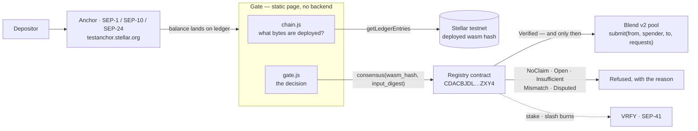

# Pitch deck content — Stellar Pro Hackathon 2026, Scale track

> **What this file is.** The text for the submitted deck, slide by slide, ready to paste into a
> copy of the official template. The handbook requires that template as the foundation and says
> to copy it rather than edit the original, so the deck itself lives in Google Slides; this file
> is the source of truth for what goes on each slide.
>
> Template: `docs.google.com/presentation/d/1TMqmeS0wdlFbl7TaVI8QNz96eP-tsj_DjHJHOnvE5NA`
> Structure kept intact: **Cover → The Solution → PMF → Technical Workflow → The Team.**
> Two extra slides are marked **(added)** — the handbook permits additions.
>
> **Every number below was run or read on 2026-09-20.** Nothing here is a projection except the
> line that says it is.

---

## Slide 1 — Cover

> Template slide. Only the project line is ours.

**Sorofy**

Money does not enter code nobody has checked.

`sorofy.site/gate/` · Stellar testnet · Scale track

---

## Slide 2 — The Solution

> Template prompt: *present your idea as the answer to the pain point; why is this the best way
> to fix it; keep it short; what makes it unique.*

### A deposit that refuses to move into unverified code.

Sorofy rebuilds a Soroban contract from source in a digest-pinned container and byte-compares
the result against the hash the network itself reports. That verdict is then **filed on-chain**
by verifiers who have staked a token they lose if they lie.

The gate sits in front of a real DeFi deposit. Before anything is signed it asks the registry
what a staked, slashable verifier set concluded about the target contract — and **only
`Verified` opens it.**

**What makes it different from every other "verified" badge:**

| Everyone else | Sorofy |
|---|---|
| One operator says "verified" — trust them | Any dissent makes it `Disputed`, never green |
| A badge you cannot check | Read the attestations on-chain and rebuild it yourself |
| Lying costs nothing | Lying is outvoted and **burns the liar's stake** |
| Proves *a CI ran* (SEP-55) | Proves *source → bytecode*, byte for byte |

**You do not have to trust a verifier. If it lies, it loses its stake, and you can verify that
on-chain.**

---

## Slide 3 — PMF

> Template prompt: *what real-world issue are you solving; why does it matter, who is affected,
> how big is the impact; use numbers, examples, stories.*

### On Soroban, a deployed contract is opaque bytes.

There is no programmatic way to confirm that the source an explorer shows actually compiles to
the bytes on the ledger.

**This already went wrong, on Stellar.** Stellar Lab removed its source-code tab after a
malicious WASM was shown carrying a "build verified" badge. Showing unproven source is worse
than showing none — it launders the unknown into a green tick.

**Who is affected:** anyone whose money enters a contract — a depositor into a lending pool, a
wallet rendering a contract page, an explorer deciding what to display, an anchor deciding where
a customer's balance may go.

**The gap is measurable, not theoretical.** The Blend v2 testnet pool — a live, widely-used
lending protocol — publishes `source_repo` and **no SEP-58 build metadata at all**. We read that
off the chain with `stellar contract info meta`, not from documentation. So today a depositor
into that pool has nothing to check against.

| Ecosystem | Source→bytecode verification |
|---|---|
| Ethereum | Etherscan / Sourcify |
| Solana | verified-builds |
| **Soroban** | **no production-grade equivalent** |

Sorofy's engine is already live and funded: the MVP was awarded by the SCF and runs at
`sorofy.site`. What this hackathon added is the part that makes a verdict **trustworthy without
trusting us.**

---

## Slide 4 — Technical Workflow

> Template prompt: *how the workflow works in practice; the logic and feasibility, not every
> detail.* Judging criterion 2 asks Scale-track teams for an accurate Mermaid diagram — use the
> one from `docs/hackathon-architecture.md` §1, which is drawn from running code.

### What happens before a deposit is allowed

**Three layers, one sentence each:**

- **Truth** — a deterministic rebuild anyone can repeat, in a container pinned to a registry
  digest. Same image, same bytes; a bare tag is rejected before any container starts.
- **Visibility** — conservative consensus. Green requires *every* attester to agree and the
  window to have closed. One dissent ⇒ `Disputed`. Exactly one of six states opens the gate.
- **Deterrence** — whoever is outvoted is slashed, and the stake is **burned**, not
  redistributed — so there is no bounty for manufacturing disputes.

**The verdict never comes from Sorofy.** The hash is read from the ledger, the verdict from the
contract. A lying or compromised Sorofy API cannot produce a pass; the worst a bad claim can do
is name something nobody attested, which reads `NoClaim` and blocks.

**Reading is free.** `consensus()` is simulated from a keypair generated in the page and thrown
away. No wallet, no account, no token, no payment — try it yourself at `sorofy.site/gate/`.

---

## Slide 5 — Proof *(added)*

> The handbook allows extra slides. This is the one that separates the deck from a mockup:
> everything on it is a command that was run or a transaction on testnet.

### Built and measured, not described

| | |
|---|---|
| Registry contract on testnet | `CDACBJDL…ZXY4` — quorum 3, 1,000 VRFY minimum stake, 60-ledger window, 50 % slash |
| VRFY token (SEP-41) | `CCM2LLD2…HKEDW` — wasm `3e23ccf5…`, **reproduced by Sorofy's own engine** and VERIFIED against the on-chain hash |
| Tests | **46** contract · **102** workspace (10 ignored) · **42** gate — all green |
| Mutation testing | the registry was deliberately broken 8 ways; **8 of 8** were caught |
| Real attestations | 3 staked verifiers attested the VRFY build to quorum; reads `Verified` on chain today |
| Real slashes | 2 × 500 VRFY **burned** on testnet — and the books balanced exactly: `29,004 = 29,004` |
| Live gate | `sorofy.site/gate/` — VRFY reads `Verified`, Blend v2 pool reads `NoClaim` and is **refused** |

**The refusal is the demo.** The configured Blend v2 pool has never been attested, so the gate
blocks the deposit by design and says why — *"That is not an accusation, it is the absence of
evidence."* A successful `submit()` has never run, and we do not claim one.

---

## Slide 6 — Honest limits *(added)*

> Keep this. Judges find the gaps anyway; naming them first is what makes the rest credible —
> and it is what an SCF reviewer is actually assessing.

### What this is not, stated before you ask

- **No follower mode.** Independent verifiers have no mechanism for *getting work*, so the
  staked set is three identities we funded on one machine. This is a mechanism proven on chain,
  not an independent operator network. It is the single gap between here and a decentralised
  claim — **1–2 weeks**, and it is gap #1 on the roadmap.
- **No Turkish lira.** The SEP-24 on-ramp runs end to end against `testanchor.stellar.org` —
  discovery, challenge, trustline, interactive deposit — and the balance it brings is exactly
  what the gate then guards. But that anchor handles **SRT, USDC and XLM only** (checked live).
  No TRY partner is integrated and none is claimed. That is an integration question, not a
  missing capability.
- **No economic security.** VRFY is a worthless testnet token, so today's slash deters nothing
  financially. It is a proof of mechanism.
- **The gate is client-side.** It refuses in earnest, but anyone can call the pool directly. A
  contract-level wrapper is what makes the refusal binding — a separate spike.
- **Testnet only.** No mainnet, no audit, nothing here is money.

**Next step: SCF Build Award.** M1 (MVP) is done and live. M2 (testnet + decentralisation) is
mostly done — the registry landed this hackathon; follower mode is the named gap. Full roadmap
with estimates: `docs/hackathon-roadmap.md`.

---

## Slide 7 — The Team

> Template prompt: *who is behind the project; skills and roles; a small picture; max 3 lines
> per member.*
>
> **⚠️ FILL THIS IN — I do not have the facts.** What I can see from the repository is one
> author (`Erdem Aşık`, MIT © 2026). Replace the bracketed text; if the team is more than one
> person, add them. Do not let this slide be the only vague one in the deck.

**Erdem Aşık** — [role]
[Line 1: Soroban / Rust background — the concrete thing, e.g. "built the deterministic build
engine and the registry contract."]
[Line 2: prior Stellar work — the SCF-awarded MVP is the strongest fact here.]
[Line 3: why this team finishes it.]

*Eligibility note for the Scale track: at least one member must show proven Soroban experience.
The SCF-awarded, live-on-testnet MVP at `sorofy.site` is that evidence — say so explicitly.*

---

## Submission form — what the portal asks for

From the handbook's "How To Submit Your Project". Have these ready:

| Field | Value |
|---|---|
| GitHub repository | `github.com/erdemasik001/Sorofy` — start the judge at [HACKATHON.md](../HACKATHON.md) |
| Live demo / front-end URL | **`https://sorofy.site/gate/`** |
| Deployed contracts | [`contracts/deployments/testnet.json`](../contracts/deployments/testnet.json) |
| Presentation / pitch deck link | the copied template — **set it to "Anyone with the link can view"** |
| Track | **Scale** — only the tracks selected at submission are evaluated |
| Skill files used | none; stated and explained in [HACKATHON.md](../HACKATHON.md) |
