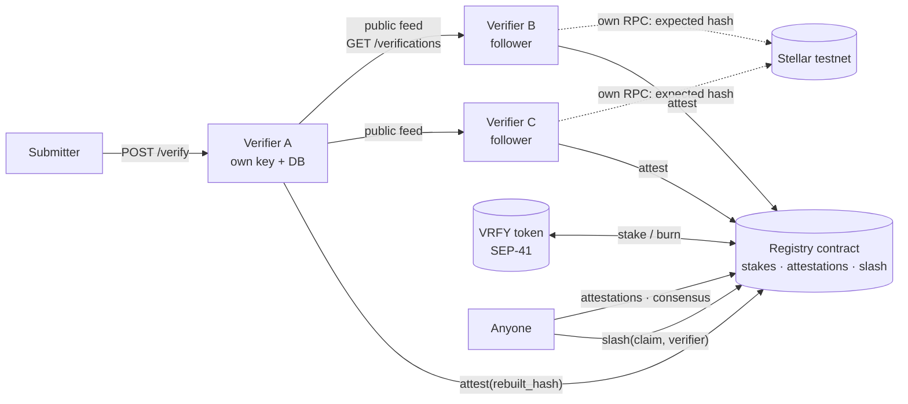

# Multi-verifier design — staked verifiers, on-chain results

> **Status: design, not implemented.** Written 2026-09-19 for the Stellar Pro Hackathon
> (Scale track), revised the same day. Nothing below exists in the repository until the
> corresponding step in [HACKATHON.md](../HACKATHON.md) says so. Testnet only.
>
> This supersedes, for the hackathon, the off-chain "signed attestation" sketch under
> Phase 3 of [testnet-roadmap.md](testnet-roadmap.md). That document is left as it was.
> Reward economics are a *projection* and live in [verifier-economics.md](verifier-economics.md).

## 1. What changes

| | Before (`master` @ `247fa84`) | After (this design) |
|---|---|---|
| Who verifies | One operator's instance. There is no notion of a verifier identity | Any account that stakes VRFY becomes an eligible verifier |
| Where a result lives | The operator's SQLite file | The API DB **and** a Soroban registry contract |
| Checking a result without trusting the operator | No | Yes: read the attestations from the chain, compare with your own rebuild |
| A single dishonest verifier | Cannot be told apart from an honest one | Cannot produce a green result alone; loses stake if outvoted |
| How other verifiers get work | Not applicable | *Follower mode*: they re-verify what the public feed lists (§8) |
| Who can submit jobs | Holders of one shared bearer token | Unchanged until the SEP-10 step |

The bearer token gates *submitters* (`POST /verify`). It was never a verifier allowlist —
there is none. Staking introduces verifier identity; it does not replace an access list.

## 2. The model: three layers

The slash is not a source of truth. The source of truth is that the build is deterministic, so
anyone can redo it. The design puts each job in its own layer:

| Layer | Job | Mechanism |
|---|---|---|
| **1. Truth** | A lie must be *catchable* | Reproducibility: same source + pinned image ⇒ same hash. Every attestation's inputs can be recomputed from the public record |
| **2. Visibility** | One liar must not be able to show a green result | *Conservative consensus* (§6): `Verified` only if every attester agrees; any dissent is `Disputed` |
| **3. Deterrence** | A lie must cost something | Majority-based slash (§7): the outvoted verifier's stake is burned |

Disagreement is surfaced by layer 2 alone. Layer 3 puts a price on dishonesty; it is not what
makes the result trustworthy.

## 3. Actors

- **Verifier** — a Stellar account with ≥ `MIN_STAKE` VRFY staked. Runs a `sorofy-api`
  instance with its own key and its own database. Attests results.
- **Deployer** — deploys the contracts and mints test VRFY. The registry has **no admin
  functions**: parameters are fixed in the constructor, and changing one means deploying a new
  registry. The deployer cannot attest, move stakes or slash.
- **Anyone** — can read attestations and consensus, and can call `slash` (permissionless; the
  contract, not the caller, decides whether a call is valid).

## 4. The claim (what a verifier attests to)

A result is only comparable between verifiers if they were asked the *same question*. A result
depends on the wasm hash **and** the source, the build image and the build flags. An honest
verifier handed a different source would legitimately report `mismatch`; a registry keyed on
`wasm_hash` alone would call that a conflict and slash an honest node.

```
claim = (wasm_hash, input_digest)
input_digest = sha256( "sorofy-claim-v1" ‖ source_sha256 ‖ bldimg_digest ‖ canonical(bldopt) )
```

`canonical(bldopt)` is a length-prefixed concatenation in submission order. The exact byte
layout is fixed in STEP 4 and shared by the contract tests and the API, so both derive the same
digest. `source_sha256` is the archive digest, or the staged tree's digest for a git source
(deterministic across verifiers; see the determinism note in the roadmap).

An attestation carries the **rebuilt hash**, not just a verdict:

```
attest(verifier, wasm_hash, input_digest, rebuilt_hash)
result := Verified  if rebuilt_hash == wasm_hash  else  Mismatch      // derived by the contract
```

A verifier cannot attest an internally inconsistent tuple, and honest `mismatch` attestations
are comparable too, because they must agree on the rebuilt hash. Job `error` outcomes (fetch
failure, timeout, infrastructure) are **never attested**: they say nothing about the contract.

## 5. Contract interface (registry)

Signatures are conceptual; STEP 4 pins them against the installed `soroban-sdk` and CLI. Every
state-changing entry point calls `require_auth` on the acting account.

| Function | Effect |
|---|---|
| `__constructor(token, min_stake, quorum, attest_window, unbond_period, slash_bps)` | Fixes the parameters. No setter exists afterwards |
| `stake(verifier, amount)` | Pulls VRFY from the verifier into the registry; the verifier is *active* while stake ≥ `min_stake` |
| `request_unstake(verifier, amount)` | Moves stake into an unbonding entry that stays slashable |
| `withdraw(verifier)` | Releases unbonded stake once `unbond_period` ledgers have passed |
| `attest(verifier, wasm_hash, input_digest, rebuilt_hash)` | Records one attestation. Rejected if: verifier not active, claim window closed, or this verifier already attested this claim |
| `attestations(wasm_hash, input_digest)` | All attestations for the claim, with ledger numbers |
| `consensus(wasm_hash, input_digest)` | See §6 |
| `slash(wasm_hash, input_digest, verifier)` | Burns `slash_bps` of that verifier's stake (including unbonding stake) — see §7 |

Why `request_unstake`/`withdraw` exist: without a delay a verifier could attest a lie and pull
its stake out before anyone could slash it. Invariant: `unbond_period ≥ attest_window`.

**Demo parameters (proposal, fixed in STEP 4):** `quorum = 3`, `attest_window = 60` ledgers
(≈ 5 min; the window opens at the claim's first attestation), `unbond_period = 120`,
`slash_bps = 5000`, `min_stake` such that one slash drops a verifier below it and it is
deactivated. Config in *instance* storage; stakes, unbonding entries, attestations and slash
marks in *persistent* storage with TTL extension on write. Events are emitted for stake, attest
and slash so an indexer can follow them. (Checked against the current docs in STEP 4, not
assumed.)

## 6. Consensus — what a consumer sees (conservative)

```
window_open  := current_ledger < first_attestation_ledger + attest_window
N            := number of attestations

consensus(claim) =
    None                              no attestation yet
    Open(tally)                       window still open — never green
    Insufficient(tally)               window closed with N < quorum
    Verified                          closed, N ≥ quorum, every attester holds the same hash h, h == wasm_hash
    Mismatch                          closed, N ≥ quorum, every attester holds the same hash h, h != wasm_hash
    Disputed(tally)                   closed, N ≥ quorum, more than one distinct hash
```

**Any dissent is `Disputed`, permanently.** A slash does not turn a disputed claim green: the
dissenting attestation stays on the record. So a colluding majority can burn an honest
dissenter's stake but cannot produce a green result while that dissenter's attestation exists.

## 7. Slash — options considered, and the rule

The registry cannot rebuild a contract, so it cannot know who is telling the truth. Any
punishment rule has to decide truth from something on the chain. Four options:

| | How truth is decided | Pros | Cons |
|---|---|---|---|
| **A. Majority of ≥ 3 (recommended)** | The hash held by a strict majority of a closed attestation set (N ≥ `quorum`) | Fully on-chain and permissionless; deterministic builds make honest verifiers agree; small enough to build and test in the time available | Honest-majority assumption: a colluding majority slashes the honest minority. Needs ≥ 3 attesters. Finality is delayed by the window |
| B. Optimistic challenge | Anyone posts a bond and challenges; a resolver rules | Works with one verifier plus watchers | The resolver is either a trusted party (reintroduces what we remove) or a vote (option A with extra states). Bonds, windows and refunds triple the contract |
| C. Council / multisig arbiter | A named set of arbiters signs a verdict | Simple; robust against collusion *if* the council is honest | Not decentralised; no better than an admin allowlist |
| D. Stake-weighted majority | As A, weighted by stake | Sybil cost scales with capital, not account count | Whales decide; needs stake snapshots; little demo value |

**Recommendation: A, unweighted (one active verifier, one vote).** Sybil resistance is
`min_stake` per identity, and only to the extent the token has value, which on testnet it does
not (§11).

```
top          := the rebuilt_hash held by the most attesters
decided      := ¬window_open ∧ N ≥ quorum ∧ 2 · count(top) > N

slash(claim, v) succeeds iff
    decided  ∧  v attested  ∧  v's rebuilt_hash ≠ top  ∧  (claim, v) not already slashed
```

- **Who can call it:** anyone. The contract validates the call.
- **1–1 split (or 1–1–1): nobody is slashed.** No strict majority ⇒ no slash, and consensus is
  `Disputed` or `Insufficient`, never green.
- **Why a window:** without it a late attester could flip a majority *after* a slash ran. The
  set is frozen when the window closes, and only a frozen set can be slashed on.
- **Slashing an unbonding verifier:** allowed; unbonding stake stays exposed until `withdraw`,
  and `unbond_period ≥ attest_window` keeps it there when a claim closes.
- **Amount, and why it is burned:** `slash_bps` of the verifier's total (staked + unbonding)
  stake, burned via the token's `burn`; one slash per `(claim, verifier)`. It is burned rather
  than paid to the majority *on purpose*: paying the majority would make slashing an honest
  minority profitable, which is exactly the collusion incentive we do not want to create.

## 8. Follower mode — how other verifiers get work

Nothing assigns jobs to verifiers, and requiring every verifier to be handed a `POST` would make
independence impossible. Instead a verifier can **follow** another instance's public feed:

1. Poll `GET <upstream>/verifications` — public, no token. (Checked against the live service:
   each row carries `contract_id`, `source`, `bldimg`, `status`, and for finished jobs
   `report.bldopt`.)
2. For each finished row that has a `contract_id` and that this verifier has not yet attested:
   resolve the expected hash **from its own RPC** — never from the upstream row — and rebuild
   with the same `reproduce()` under the same sandbox and admission limits as a normal job.
3. Compute the claim from its *own* report and attest its *own* result.

The upstream's `status` and hash are ignored; only the *inputs* (source, image, flags) are
used, and they are treated as untrusted exactly like a `POST` body (same SSRF guards, same
sandbox). Rows that carry only a bare `wasm_hash` are skipped: there is nothing to resolve
independently.

Why it matters: a follower needs no token and no permission from anyone, so a third party can
run one on a laptop with its own key; it removes the need for a job-distribution protocol; and
the demo becomes "two verifiers independently re-check a third" rather than "the script sends
the same request to three places". Bounded by a per-hour job cap and off by default.

Caveat carried into the public-`POST` decision (STEP 7/9): if `POST /verify` is ever opened to
strangers, the feed carries stranger-chosen sources and every follower builds them. The sandbox
is the same, but that widens the surface and must be decided knowingly.

## 9. Where data lives

| Data | On-chain (registry) | API database |
|---|---|---|
| Stake, unbonding, active flag | ✅ | cached copy for the explorer |
| Attestation `(verifier, rebuilt_hash, ledger)` | ✅ | ✅ (own outgoing attestation) |
| Consensus / slash outcome | ✅ (derived) | cached copy |
| Attest transaction hash, submission status, attempts, last error | — | ✅ new `attestations` table (`tx_hash` lives here) |
| Source URI, build log, timings, full report | — | ✅ unchanged `verifications` table |

`attestations` is a separate table rather than a column on `verifications`: a retry needs
state, and the startup sweep (`fail_orphaned_pending`) only touches `verifications`, so an
attestation queued before a restart is retried, not failed.

### API behaviour (STEP 5), non-negotiable

- Behind a flag, default **off**. Off means responses and behaviour identical to today.
- Written **after** the verification result is stored, from a detached task. It never holds a
  build or admission slot and never changes the verification's status.
- A registry or RPC failure is recorded and retried with backoff. It cannot fail or delay a
  verification.
- The verifier's signing key comes from a file the operator points at; never logged, never in
  an error chain. It is a testnet key with no value.

## 10. Trust model — two different guarantees

- **Safety (no false green).** A green `Verified` needs *every* attester to agree. A false one
  therefore needs `quorum`-many colluding identities **and no honest staked verifier attesting
  that claim inside the window**. One honest attester in the window turns it into `Disputed`.
- **Fairness of punishment.** The slash follows the majority, so it is only fair if a majority
  of the attesters is honest. A colluding majority can burn an honest dissenter, but cannot
  make the claim green.

In plain words: to be safe you need **one** honest staked verifier watching; to be *punished
fairly* you need an honest majority. You never have to trust a single verifier's word — you can
read the attestations and rebuild the contract yourself.

## 11. What this does not do

This is the honest boundary of the claim. It is a **proof of mechanism on testnet**, not
economic security.

1. **The slash decides truth by vote, not by proof.** A colluding majority can slash an honest
   minority (it cannot make the result green, §6). Independence of operators cannot be enforced
   on-chain: identities are not distinguishable.
2. **We run the demo verifiers.** Follower mode lets an independent operator join without
   permission, but unless one actually does, independence is a capability, not a fact. If one
   joins during the event it is recorded in HACKATHON.md; otherwise nothing is claimed.
3. **VRFY is a worthless testnet token.** Stake is not collateral in any economic sense.
4. **No rewards and no liveness pressure.** A staked verifier earns nothing for attesting and
   is not penalised for staying silent. A reward model exists only as a
   [projection](verifier-economics.md); the contract pays nothing.
5. **Attestations are public, so a lazy verifier can copy others** and still be "right". No
   commit-reveal is implemented.
6. **No coverage guarantee.** Followers are optional. Nothing ensures any given claim is
   re-checked by anyone.
7. **The window is a liveness requirement.** An honest verifier that attests after the window
   closes is rejected; if all honest verifiers are late, a colluding quorum could stay green.
8. **`trust_level` is still `arbitrary`.** Attesting proves "this source in this image yields
   this hash", not that the image is honest.
9. **Determinism across hosts is assumed, not proven here.** The pinned image is linux/amd64.
   Whether a verifier on an emulated arm64 host lands on the same hash is measured in STEP 5–6.
10. **Immutable parameters, no upgrade path, no audit.** Changing anything means a new registry
    and a new stake. Not audited; testnet only.
11. **A late `slash` can miss.** If the stake has been withdrawn, there is nothing to burn.
12. **Access to `POST /verify` is unchanged** until the SEP-10 step; it is still one shared
    bearer token.
13. Out of scope by decision: SEP-6 deposits, fiat rails, a credit system, mainnet.

## 12. Flow



*Planned; drawn from this design, not from running code. STEP 10 replaces it with a diagram of
what was actually built.*
