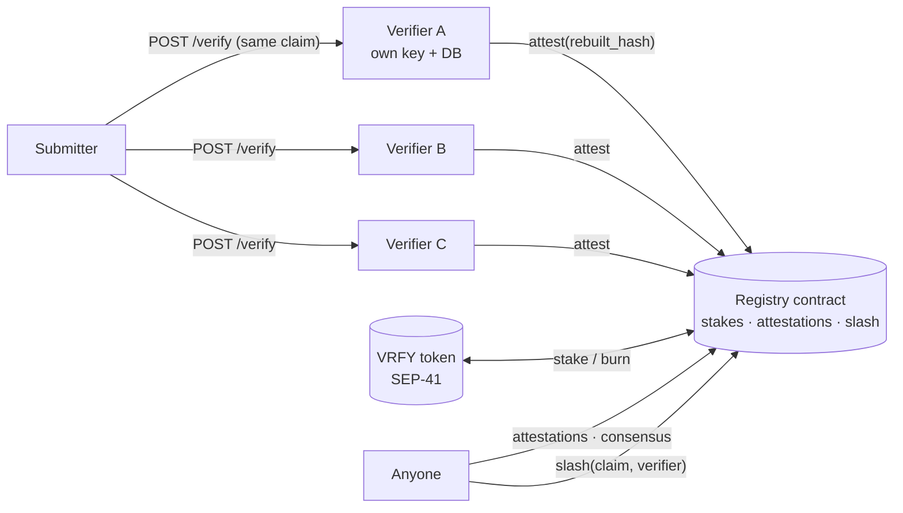

# Multi-verifier design — staked verifiers, on-chain results

> **Status: design, not implemented.** Written 2026-09-19 for the Stellar Pro Hackathon
> (Scale track). Nothing below exists in the repository until the corresponding step in
> [HACKATHON.md](../HACKATHON.md) says so. Testnet only.
>
> This supersedes, for the hackathon, the off-chain "signed attestation" sketch under
> Phase 3 of [testnet-roadmap.md](testnet-roadmap.md). That document is left as it was.

## 1. What changes

| | Before (`master` @ `247fa84`) | After (this design) |
|---|---|---|
| Who verifies | One operator's instance. There is no notion of a verifier identity | Any account that stakes VRFY becomes an eligible verifier |
| Where a result lives | The operator's SQLite file | The API DB **and** a Soroban registry contract |
| Can a result be checked without trusting the operator | No | Yes: read the attestations from the chain, compare them with your own rebuild |
| What a wrong result costs the verifier | Nothing | Stake is burned by an on-chain `slash` |
| Who can submit jobs | Holders of one shared bearer token | Unchanged until STEP 8 |

The bearer token gates *submitters* (`POST /verify`). It was never a verifier allowlist —
there is none. Staking introduces verifier identity; it does not replace an access list.

## 2. Actors

- **Verifier** — a Stellar account with ≥ `MIN_STAKE` VRFY staked. Runs a `sorofy-api`
  instance with its own key and its own database. Attests results.
- **Deployer** — the account that deploys the contracts and mints test VRFY. The registry has
  **no admin functions**: parameters are fixed in the constructor, and changing one means
  deploying a new registry. The deployer cannot attest, move stakes or slash.
- **Anyone** — can read attestations and consensus, and can call `slash` (permissionless; the
  contract, not the caller, decides whether the call is valid).

## 3. The claim (what a verifier attests to)

A result is only comparable between verifiers if they were asked the *same question*. Today a
result depends on the wasm hash **and** the source, the build image and the build flags. An
honest verifier that was handed a different source would legitimately report `mismatch`, and a
registry keyed on `wasm_hash` alone would call that a conflict and slash an honest node.

```
claim = (wasm_hash, input_digest)
input_digest = sha256( "sorofy-claim-v1" ‖ source_sha256 ‖ bldimg_digest ‖ canonical(bldopt) )
```

`canonical(bldopt)` is a length-prefixed concatenation in submission order. The exact byte
layout is fixed in STEP 4 and shared by the contract tests and the API, so both sides derive the
same digest. `source_sha256` is the archive digest, or the staged tree's digest for a git
source (already deterministic across verifiers, see the determinism note in the roadmap).

An attestation carries the **rebuilt hash**, not just a verdict:

```
attest(verifier, wasm_hash, input_digest, rebuilt_hash)
result := Verified  if rebuilt_hash == wasm_hash  else  Mismatch      // derived by the contract
```

Two consequences. A verifier cannot attest an internally inconsistent tuple, and honest
`mismatch` attestations are comparable too, because they must agree on the rebuilt hash.
Job `error` outcomes (fetch failure, timeout, infrastructure) are **never attested**: they say
nothing about the contract.

## 4. Contract interface (registry)

Signatures are conceptual; STEP 4 pins them against the installed `soroban-sdk` and CLI.
Every state-changing entry point calls `require_auth` on the acting account.

| Function | Effect |
|---|---|
| `__constructor(token, min_stake, quorum, attest_window, unbond_period, slash_bps)` | Fixes the parameters. No setter exists afterwards |
| `stake(verifier, amount)` | Pulls VRFY from the verifier into the registry; verifier is *active* while stake ≥ `min_stake` |
| `request_unstake(verifier, amount)` | Moves stake into an unbonding entry that stays slashable |
| `withdraw(verifier)` | Releases unbonded stake once `unbond_period` ledgers have passed |
| `attest(verifier, wasm_hash, input_digest, rebuilt_hash)` | Records one attestation. Rejected if: verifier not active, claim window closed, or this verifier already attested this claim |
| `attestations(wasm_hash, input_digest)` | All attestations for the claim, with ledger numbers |
| `consensus(wasm_hash, input_digest)` | `Open` (window still running) · `Undecided` · `Decided(rebuilt_hash, votes, total)` |
| `slash(wasm_hash, input_digest, verifier)` | Burns `slash_bps` of that verifier's stake (including unbonding stake) — see §5 |

Why `request_unstake`/`withdraw` exist: without a delay a verifier could attest a lie and pull
its stake out before anyone could slash it. Invariant: `unbond_period ≥ attest_window`.

**Demo parameters (proposal, fixed in STEP 4):** `quorum = 3`, `attest_window = 60` ledgers
(≈ 5 min; the window opens at the claim's first attestation), `unbond_period = 120`,
`slash_bps = 5000`, `min_stake` such that one slash drops a verifier below it and it is
deactivated. Contract storage: config in *instance* storage; stakes, unbonding entries,
attestations and slash marks in *persistent* storage with TTL extension on write. Events are
emitted for stake, attest and slash so an indexer can follow them. (Checked against the
current docs in STEP 4, not assumed.)

## 5. Slash rule — options considered

The registry cannot rebuild a contract, so it cannot know who is telling the truth. Any rule
has to decide truth from something on the chain. Four options:

| | How truth is decided | Pros | Cons |
|---|---|---|---|
| **A. Majority of ≥ 3 (recommended)** | The result held by a strict majority of a closed attestation set (N ≥ `quorum`) | Fully on-chain and permissionless; deterministic builds make honest verifiers agree; small enough to build and test in the time available | Honest-majority assumption: a colluding majority slashes the honest minority. Needs ≥ 3 attesters. Finality is delayed by the window |
| B. Optimistic challenge | Anyone posts a bond and challenges; a resolver rules | Works with one verifier plus watchers | The resolver is either a trusted party (reintroduces the thing we remove) or a vote (that is option A with extra states). Bonds, windows and refunds triple the contract |
| C. Council / multisig arbiter | A named set of arbiters signs a verdict | Simple, robust against collusion *if* the council is honest | Not decentralised; no better than an admin allowlist |
| D. Stake-weighted majority | As A, but votes weighted by stake | Sybil cost scales with capital, not with account count | Whales decide; needs stake snapshots. Adds surface for little demo value |

**Recommendation: A, unweighted (one active verifier, one vote).** Sybil resistance comes from
`min_stake` per identity, and only to the extent the token has value, which on testnet it does
not (see §8).

### The rule, precisely

```
closed(claim)    := current_ledger ≥ first_attestation_ledger + attest_window
N                := number of attestations on the claim
top              := the rebuilt_hash held by the most attesters
decided(claim)   := closed ∧ N ≥ quorum ∧ 2 · count(top) > N

slash(claim, v) succeeds iff
    decided(claim)  ∧  v attested  ∧  v's rebuilt_hash ≠ top  ∧  (claim, v) not already slashed
```

- **Who can call it:** anyone. The caller gains nothing in this version (the slashed amount is
  burned, not paid out), so there is no incentive attack on the call itself, and also no reward
  for making it — a limitation, see §8.
- **1–1 split (or 1–1–1): nobody is slashed.** With two attesters, or three distinct results,
  there is no strict majority. The claim stays `Undecided`; the system does not announce a
  consensus and does not punish either side. It resolves only if the window is still open and
  further verifiers attest. If it closes undecided it stays undecided.
- **Why a window:** without it, a late attester could flip a majority *after* a slash was
  executed. The set is frozen when the window closes, and only a frozen set can be slashed on.
- **Slashing an unbonding verifier:** allowed; unbonding stake stays exposed until `withdraw`,
  and `unbond_period ≥ attest_window` guarantees it is still there when a claim closes. A slash
  called after the stake was withdrawn finds nothing to burn.
- **Amount:** `slash_bps` of the verifier's total (staked + unbonding) stake, burned via the
  token's `burn`. One slash per `(claim, verifier)`.

## 6. Where data lives

| Data | On-chain (registry) | API database |
|---|---|---|
| Stake, unbonding, active flag | ✅ | cached copy for the explorer |
| Attestation `(verifier, rebuilt_hash, ledger)` | ✅ | ✅ (own outgoing attestation) |
| Consensus / slash outcome | ✅ (derived) | cached copy |
| Attest transaction hash, submission status, attempts, last error | — | ✅ new `attestations` table (`tx_hash` lives here) |
| Source URI, build log, timings, full report | — | ✅ unchanged `verifications` table |

`attestations` is a separate table rather than a column on `verifications`: a retry needs
state, and the existing startup sweep (`fail_orphaned_pending`) only touches `verifications`,
so an attestation queued before a restart is retried, not failed.

### API behaviour (STEP 5), non-negotiable

- Behind a flag, default **off**. Off means responses and behaviour identical to today.
- Written **after** the verification result is stored, from a detached task. It never holds a
  build or admission slot and never changes the verification's status.
- A registry or RPC failure is recorded and retried with backoff. It cannot fail or delay a
  verification.
- The verifier's signing key comes from a file the operator points at; it is never logged and
  never in an error chain. It is a testnet key with no value.

## 7. Trust model in one paragraph

You do not have to trust a verifier's word. You read the registry, see who attested which
rebuilt hash, and can rebuild the contract yourself with the pinned image. If a strict majority
of staked verifiers disagrees with one of them, that verifier's stake is burned by a contract
call anyone can make, and the burn is visible on the chain.

## 8. What this does not do

This is the honest boundary of the claim. It is a **proof of mechanism on testnet**, not
economic security.

1. **The slash decides truth by vote, not by proof.** A colluding majority can slash an honest
   minority. Security assumes an honest majority of *independent* operators.
2. **We run all three demo verifiers.** They are not independent operators. The mechanism is
   demonstrated; the decentralisation it enables is not yet present in the deployment.
3. **VRFY is a worthless testnet token.** Stake is not collateral in any economic sense.
   No token economics were designed: no rewards, fees, emission or pricing.
4. **No liveness pressure.** A staked verifier that never attests is not penalised. There is no
   reward for attesting or for calling `slash`.
5. **Attestations are public, so a lazy verifier can copy others** and still be "right". No
   commit-reveal is implemented.
6. **No job-distribution protocol.** Each verifier instance receives jobs on its own `POST`;
   the demo script submits the same request to each. Nothing assigns work or checks coverage.
7. **`trust_level` is still `arbitrary`.** Attesting proves "this source in this image yields
   this hash", not that the image is honest.
8. **Determinism across hosts is assumed, not proven here.** The pinned image is
   linux/amd64. Whether a verifier on an emulated arm64 host lands on the same hash is
   measured in STEP 5–6, not assumed.
9. **Immutable parameters, no upgrade path, no audit.** Changing anything means a new registry
   and a new stake. Not audited; testnet only.
10. **A late `slash` can miss.** If the stake has been withdrawn, there is nothing to burn.
11. **Access to `POST /verify` is unchanged** until the SEP-10 step lands; it is still one
    shared bearer token.
12. Out of scope by decision: SEP-6 deposits, fiat rails, a credit system, mainnet.

## 9. Flow



*Planned; drawn from this design, not from running code. STEP 10 replaces it with a diagram of
what was actually built.*
